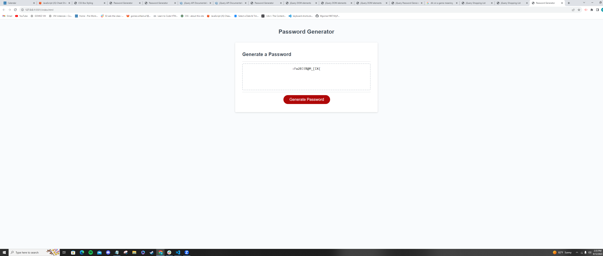

# PasswordGenAssignment

## Password Generator HW

Password Generator generates a password for the user.

It includes special characters, numbers, uppercase, and lower case letters.

When the user clicks the button, the app will send a prompt asking how many characters they would like their password to be.  They are allowed to choose from 8 - 128 characters.  The app will then prompt them to say whether or not they would like to have uppercase letters, lowercase letters, special characters, or numbers included into their password.  

